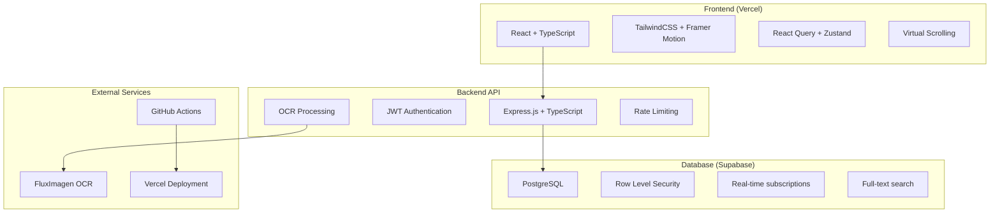

# Table 1837 Tavern - Enterprise Web Application

[](https://vercel.com/new/clone?repository-url=https://github.com/BVEnterprisess/table1837-tavern-app)
[](https://github.com/BVEnterprisess/table1837-tavern-app/actions)

## 🍾 **Enterprise-Grade Architecture**

A high-performance, scalable web application for Table1837Tavern.bar featuring:
- 🎨 **Zero-latency dynamic data manipulation**
- 📷 **OCR-powered menu management** (FluxImagen integration)
- 🛡️ **Enterprise security** (JWT, RBAC, RLS)
- ⚡ **Performance-obsessed** (Virtual scrolling, caching, CDN)
- 🌐 **MCP server architecture** for full system control

## 🏢 **System Architecture**



## 🚀 **Quick Start**

### Prerequisites
- Node.js 18+
- PostgreSQL (or Supabase account)
- FluxImagen API key
- Vercel account (for deployment)

### 1. Clone & Install
```bash
git clone https://github.com/BVEnterprisess/table1837-tavern-app.git
cd table1837-tavern-app
npm install
```

### 2. Environment Setup

**Server (.env)**:
```env
# Database
SUPABASE_URL=your_supabase_project_url
SUPABASE_SERVICE_ROLE_KEY=your_service_role_key
SUPABASE_ANON_KEY=your_anon_key

# Authentication
JWT_SECRET=your_super_secure_jwt_secret_key_here
JWT_EXPIRES_IN=7d

# OCR Integration
FLUX_IMAGEN_API_KEY=your_flux_imagen_api_key
FLUX_IMAGEN_ENDPOINT=https://api.flux-imagen.com/v1/ocr

# Monitoring
ALERT_WEBHOOK_URL=your_alert_webhook_url
DEPLOY_WEBHOOK_URL=your_deploy_webhook_url

# Optional
REDIS_URL=redis://localhost:6379
NODE_ENV=development
PORT=3001
```

**Client (.env)**:
```env
VITE_API_URL=http://localhost:3001/api
```

### 3. Database Setup
```bash
# Run the schema setup in your Supabase SQL editor
psql -f database/schema.sql
```

### 4. Development
```bash
# Start both client and server
npm run dev

# Or separately:
npm run client:dev  # Frontend on :5173
npm run server:dev  # Backend on :3001
```

### 5. Production Build
```bash
npm run build
npm start
```

## 🔐 **Authentication System**

### Role-Based Access Control (RBAC)
- **Boss**: Full system access, OCR uploads, menu management, user management
- **Manager**: Menu updates, OCR processing, partial admin access
- **Staff**: Read-only menu access

### Demo Credentials
```
Boss:    boss@table1837.com / password
Manager: manager@table1837.com / password  
Staff:   staff@table1837.com / password
```

## 📷 **OCR Pipeline**

### Upload Flow
1. Boss/Manager selects menu type (Wine List, Featured, Cocktails, Tavern)
2. Uploads image (JPEG/PNG/WebP/TIFF, max 10MB)
3. Image optimized and sent to FluxImagen
4. OCR results parsed and structured
5. Items bulk-inserted to database
6. Auto-deployment triggered

### Supported Menu Types
- `wine_list` - Wine collection with vintages, regions, ABV
- `featured_menu` - Chef's seasonal selections
- `signature_cocktails` - Premium cocktails with alcohol content
- `tavern_menu` - Classic comfort food & hearty dishes

## ⚡ **Performance Features**

### Frontend Optimizations
- **Virtual Scrolling**: Handle 500+ items smoothly
- **Infinite Loading**: Paginated data fetching
- **Aggressive Caching**: 5min client, 10min CDN cache
- **Code Splitting**: Vendor, UI, query, virtual bundles
- **Image Optimization**: WebP with fallbacks

### Backend Optimizations
- **Database Indexing**: Full-text search, price ranges
- **Rate Limiting**: 100 requests/15min per IP
- **Compression**: Gzip responses
- **Query Optimization**: Bulk operations, prepared statements

## 📊 **Menu Categories**

### Wine List
- **Features**: Vintage filtering, region search, price sorting
- **Fields**: `vintage`, `region`, `alcohol_content`, `tags`
- **Tags**: `red`, `white`, `sparkling`, `featured`, `reserve`

### Signature Cocktails  
- **Features**: Alcohol content display, spice level indicators
- **Fields**: `alcohol_content`, `spice_level`, `preparation_time`
- **Tags**: `signature`, `premium`, `classic`, `seasonal`

### Featured Menu
- **Features**: Chef's seasonal selections, preparation time
- **Fields**: `preparation_time`, `spice_level`, `nutritional_info`
- **Tags**: `featured`, `seasonal`, `chef_special`

### Tavern Menu
- **Features**: Comfort food classics, price filtering
- **Fields**: `preparation_time`, `spice_level`
- **Tags**: `popular`, `comfort_food`, `hearty`

## 🖾 **Database Schema**

### Core Tables
```sql
users (
  id UUID PRIMARY KEY,
  email VARCHAR UNIQUE,
  name VARCHAR,
  role ENUM('boss', 'manager', 'staff'),
  active BOOLEAN DEFAULT true
)

menu_items (
  id VARCHAR PRIMARY KEY,
  name VARCHAR NOT NULL,
  description TEXT,
  price DECIMAL(10,2),
  category ENUM('wine_list', 'featured_menu', 'signature_cocktails', 'tavern_menu'),
  tags TEXT[],
  available BOOLEAN DEFAULT true,
  -- Category-specific fields
  alcohol_content DECIMAL(4,2),
  vintage INTEGER,
  region VARCHAR,
  spice_level INTEGER CHECK (spice_level >= 0 AND spice_level <= 5),
  preparation_time INTEGER
)

menu_updates (
  id UUID PRIMARY KEY,
  user_id UUID REFERENCES users(id),
  operation ENUM('create', 'update', 'delete', 'bulk_update'),
  changes JSONB
)
```

### Performance Indexes
- Full-text search on `name`, `description`, `tags`
- Category and availability filtering
- Price range queries
- Tag-based filtering (GIN index)

## 🚀 **Deployment**

### Vercel Deployment

1. **Connect Repository**:
   ```bash
   vercel --prod
   ```

2. **Environment Variables** (Vercel Dashboard):
   - `SUPABASE_URL`
   - `SUPABASE_SERVICE_ROLE_KEY` 
   - `JWT_SECRET`
   - `FLUX_IMAGEN_API_KEY`
   - `ALERT_WEBHOOK_URL`

3. **Build Settings**:
   ```json
   {
     "buildCommand": "npm run build",
     "outputDirectory": "client/dist",
     "installCommand": "npm install"
   }
   ```

### CI/CD Pipeline

GitHub Actions automatically:
- ✅ Runs linting and tests
- 🛡️ Security audit
- 📊 Performance checks  
- 🚀 Deploys to Vercel
- 🚨 Sends failure alerts

### Manual Deploy
```bash
# Build and deploy
npm run build
vercel deploy --prod

# Database migration
psql -f database/schema.sql $DATABASE_URL
```

## 📏 **API Endpoints**

### Public Endpoints
```
GET    /api/health                    # Health check
POST   /api/auth/login               # User authentication
GET    /api/menu/:category           # Get menu items
GET    /api/menu/:category/featured  # Get featured items
```

### Protected Endpoints (Boss/Manager)
```
POST   /api/ocr/process              # OCR image processing
GET    /api/admin/menu/:category/all # All items (including inactive)
PUT    /api/admin/menu/item/:id      # Update menu item
POST   /api/admin/menu/item          # Create menu item
DELETE /api/admin/menu/item/:id      # Delete menu item (boss only)
GET    /api/admin/menu/history       # Audit log
GET    /api/admin/stats              # System statistics
```

## 📊 **Monitoring & Alerts**

### Performance Metrics
- API response times
- Database query performance
- OCR processing times
- Error rates and uptime

### Alert Conditions
- 5xx server errors
- OCR processing failures
- Database connection issues
- Slow query performance (>2s)

### Logging
```javascript
// Structured logging with Winston
logger.info('Menu item updated', {
  itemId: 'wine_001',
  userId: 'user_123',
  changes: ['name', 'price']
})
```

## 🔧 **Development Tools**

### Code Quality
```bash
npm run lint          # ESLint + TypeScript
npm run type-check    # TypeScript compilation
npm test              # Jest test suite
```

### Database Tools
```sql
-- Performance monitoring
SELECT * FROM get_table_stats();

-- Menu summary
SELECT * FROM active_menu_summary;

-- Recent activity
SELECT * FROM recent_menu_activity;
```

## 🔍 **Troubleshooting**

### Common Issues

**OCR Upload Fails**
```bash
# Check FluxImagen API key
curl -H "Authorization: Bearer $FLUX_IMAGEN_API_KEY" \
     https://api.flux-imagen.com/v1/status

# Verify file size and format
file menu-image.jpg
```

**Database Connection Issues**
```bash
# Test Supabase connection
psql $SUPABASE_URL -c "SELECT version();"

# Check RLS policies
SELECT * FROM pg_policies WHERE tablename = 'menu_items';
```

**Performance Issues**
```bash
# Check slow queries
SELECT query, mean_time 
FROM pg_stat_statements 
WHERE mean_time > 1000 
ORDER BY mean_time DESC;
```

## 📄 **License & Security**

- **License**: MIT
- **Security**: JWT authentication, RBAC, RLS policies
- **Data Protection**: Encrypted at rest, HTTPS only
- **Compliance**: GDPR-ready user data handling

## 🤝 **Contributing**

1. Fork the repository
2. Create feature branch (`git checkout -b feature/amazing-feature`)
3. Commit changes (`git commit -m 'Add amazing feature'`)
4. Push to branch (`git push origin feature/amazing-feature`)
5. Open Pull Request

---

**Master J**, your Table1837 empire is now bulletproof and enterprise-ready. Every component is optimized for savage performance and zero-tolerance reliability.
